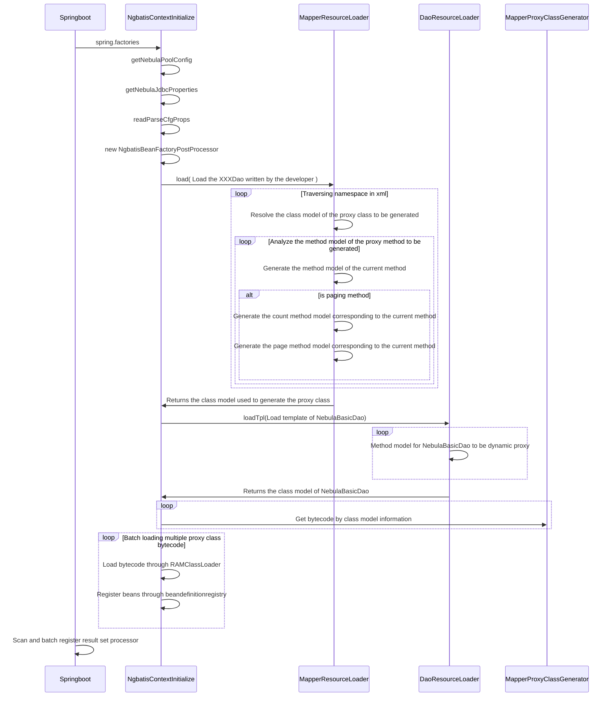
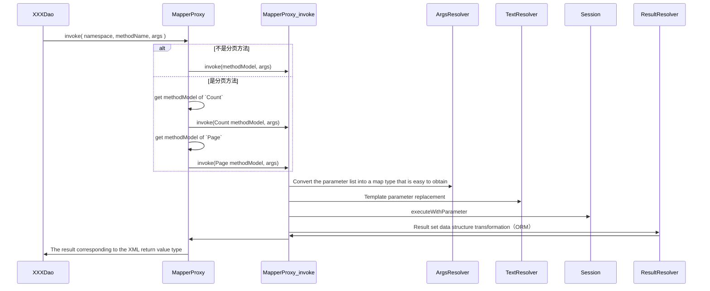

<!--
Copyright (c) 2022 All project authors and nebula-contrib. All rights reserved.

This source code is licensed under Apache 2.0 License.
-->

# Detailed Description of the Framework Execution Process

## Initialization

1. Scanned by Spring Boot for initialization. The entry point is configured in: [spring.factories](./src/main/resources/META-INF/spring.factories).
2. The starting class is: [NgbatisContextInitialize](src/main/java/org/nebula/contrib/ngbatis/NgbatisContextInitializer.java).
3. Initialization process:
    1. Read NebulaPoolConfig connection information from the Spring Boot configuration file.
    2. Create a global context: [MapperContext](src/main/java/org/nebula/contrib/ngbatis/models/MapperContext.java).
    3. Read and parse templates for NebulaDaoBasic, storing them in the context. Performed by: [DaoResourceLoader](./src/main/java/org/nebula/contrib/ngbatis/io/DaoResourceLoader.java).
        1. Read files specified by cql.parser.mapper-tpl-location.
        2. Use JSoup for XML parsing (method names, nGQL templates).
    4. Read and parse user-created XXXDao.xml files, storing them in the context. Performed by: [MapperResourceLoader](./src/main/java/org/nebula/contrib/ngbatis/io/MapperResourceLoader.java).
        1. Read all XML files specified by cql.parser.mapper-locations.
        2. Use JSoup to parse each file.
            1. Parse XML files, retrieve corresponding interfaces and create a class model: [ClassModel](./src/main/java/org/nebula/contrib/ngbatis/models/ClassModel.java).
            2. Parse subtags, retrieve specific methods, and create a method model: [MethodModel](./src/main/java/org/nebula/contrib/ngbatis/models/MethodModel.java).
    5. Create NebulaPool and store it in the context.
    6. Establish the relationship between explicit entity types and database types (MapperContext.tagTypeMapping). By default, types for the generic T of NebulaDaoBasic are loaded. If NebulaDaoBasic is not used, developers can add their own types. For example, put: key: "person," value: Person.class.
    7. Register XXXDao objects as Spring-managed beans.
        1. Generate dynamic proxy classes using ASM based on class model information. These proxy classes exist in memory as bytecode. Performed by: [MapperProxyClassGenerator](./src/main/java/org/nebula/contrib/ngbatis/proxy/MapperProxyClassGenerator.java).
            1. Class bytecode
            2. No-argument constructor bytecode
            3. Method bytecode
                > The actual method called is MapperProxy.invoke, passing in class and method information along with runtime parameters. The corresponding nGQL is retrieved from the context. See details below in [Runtime].
        2. Load the proxy class into the JVM. Performed by: [RAMClassLoader](src/main/java/org/nebula/contrib/ngbatis/proxy/RamClassLoader.java).
        3. Retrieve the fully qualified interface names from the class model and register the classes loaded in step 2 as Spring beans managed by the Spring bean container.
    8. Register result set handlers in bulk. The mechanism involves extending the AbstractResultHandler abstract class. When objects are created, they are registered in the context. This mechanism handles different result types inside ResultSets, corresponding to different return values in nGQL. For more details, see [Runtime].

> At this point, the initialization process of ngbatis dynamic proxies is complete.

## Application Configuration, Main Class [Env](src/main/java/org/nebula/contrib/ngbatis/Env.java)

1. Declare an nGQL parameter parser. The default approach uses the Beetl template engine for parsing. [BeetlTextRender](./src/main/java/org/nebula/contrib/ngbatis/binding/BeetlTextRender.java).
    > You can implement your own [TextResolver](src/main/java/org/nebula/contrib/ngbatis/TextResolver.java) and manage it with @Primary if you want to use a different text resolver.
2. Specify the primary key generator (vertex id and edge rank value setter). You can use a timestamp-based primary key generator to obtain primary keys, but it is recommended to implement your own key generation strategy based on your application's architecture.

    ```java
    @Configuration
    public class PkGeneratorConfig {
        @Bean
        public PkGenerator pkGenerator() {
            return new TimestampPkGenerator();
        }
    }
    ```

3. You can further customize result handling for various types by extending [AbstractResultHandler](./src/main/java/org/nebula/contrib/ngbatis/handler/AbstractResultHandler.java).

## Runtime

1. Business logic integrates dynamic proxy classes into business classes through dependency injection.
2. Business classes invoke actual methods and pass parameters.
3. Dynamic proxies execute MapperProxy.invoke (interface name, method name, parameter list).
    1. Read interface parameter serializers and serialize interface parameters to match placeholders in XML with key-value pairs.
    2. Replace placeholders in the XML.
    3. Retrieve a session and execute executeWithParameter.
    4. Result handling: Result handlers are routed through [ResultResolver](src/main/java/org/nebula/contrib/ngbatis/ResultResolver.java), with the choice determined by the return value declared in the method model and the declared generic resultType. In this step, the ORM process is completed.

## Developer Usage Approach (for complex extensions, see [Application Configuration] if there are no specific requirements)

1. Specify a primary key generator as shown in [Application Configuration.2].
2. Create XXXDao.java.
3. Create XXXDao.xml and specify the namespace as XXXDao.java.
4. Write nGQL in XXXDao.xml.
5. When calling the business logic, inject XXXDao directly and call the corresponding method to retrieve and execute the nGQL without handling the result set, thus obtaining the required entity objects.

# Operation Sequence

## Initialization process at service startup



## When the proxy method is called


