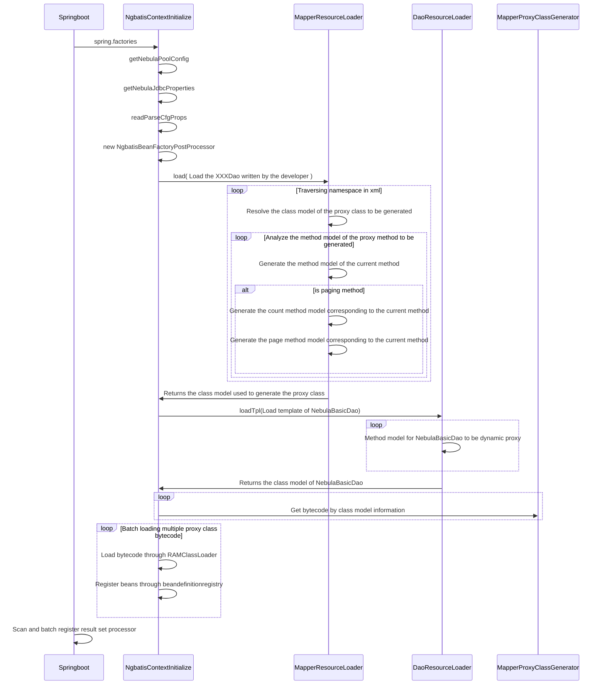
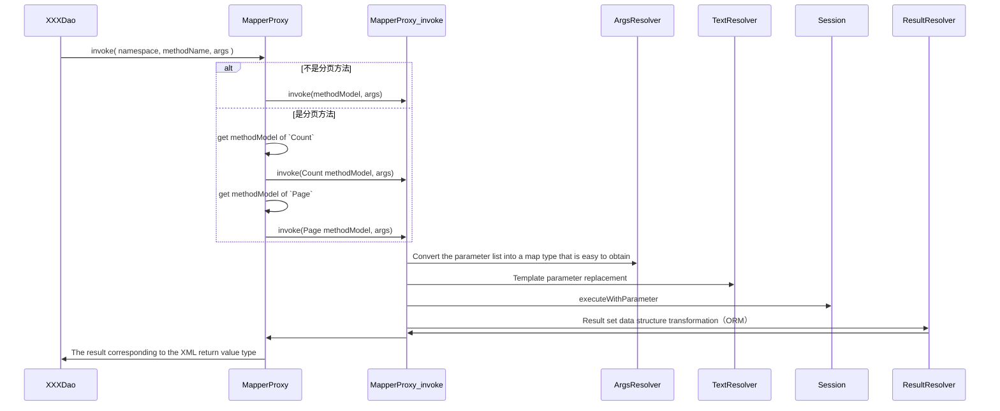

# Operatior Sequence
## Initialization process at service startup

```mermaid
sequenceDiagram
  Springboot->>NgbatisContextInitialize: spring.factories
  NgbatisContextInitialize->>NgbatisContextInitialize: getNebulaPoolConfig
  NgbatisContextInitialize->>NgbatisContextInitialize: getNebulaJdbcProperties
  NgbatisContextInitialize->>NgbatisContextInitialize: readParseCfgProps
  NgbatisContextInitialize->>NgbatisContextInitialize: new NgbatisBeanFactoryPostProcessor
  NgbatisContextInitialize->>MapperResourceLoader: load( Load the XXXDao written by the developer )
  loop Traversing namespace in xml
      MapperResourceLoader->>MapperResourceLoader: Resolve the class model of the proxy class to be generated
      loop Analyze the method model of the proxy method to be generated
          MapperResourceLoader->>MapperResourceLoader: Generate the method model of the current method
          alt is paging method
              MapperResourceLoader->>MapperResourceLoader: Generate the count method model corresponding to the current method
              MapperResourceLoader->>MapperResourceLoader: Generate the page method model corresponding to the current method
          end
      end
  end
  MapperResourceLoader->>NgbatisContextInitialize: Returns the class model used to generate the proxy class
  NgbatisContextInitialize->>DaoResourceLoader: loadTpl(Load template of NebulaBasicDao)
      loop 
          DaoResourceLoader->>DaoResourceLoader:  Method model for NebulaBasicDao to be dynamic proxy
      end
  DaoResourceLoader->>NgbatisContextInitialize: Returns the class model of NebulaBasicDao

    loop 
      NgbatisContextInitialize->>MapperProxyClassGenerator: Get bytecode by class model information
    end

    loop Batch loading multiple proxy class bytecode
      NgbatisContextInitialize->>NgbatisContextInitialize: Load bytecode through RAMClassLoader
      NgbatisContextInitialize->>NgbatisContextInitialize: Register beans through beandefinitionregistry
    end

  Springboot->>Springboot: Scan and batch register result set processor
```

## When the proxy method is called

```mermaid
sequenceDiagram
  XXXDao->>MapperProxy: invoke( namespace, methodName, args )
  alt 不是分页方法
      MapperProxy->>MapperProxy_invoke: invoke(methodModel, args)
  else 是分页方法
      MapperProxy->>MapperProxy: get methodModel of `Count`
      MapperProxy->>MapperProxy_invoke: invoke(Count methodModel, args)
      MapperProxy->>MapperProxy: get methodModel of `Page`
      MapperProxy->>MapperProxy_invoke: invoke(Page methodModel, args)
  end
  MapperProxy_invoke->>ArgsResolver: Convert the parameter list into a map type that is easy to obtain
  MapperProxy_invoke->>TextResolver: Template parameter replacement
  MapperProxy_invoke->>Session: executeWithParameter
  MapperProxy_invoke->>ResultResolver: Result set data structure transformation（ORM）
  ResultResolver->>MapperProxy_invoke: 
  MapperProxy_invoke->>MapperProxy: 
  MapperProxy->> XXXDao: The result corresponding to the XML return value type
```

