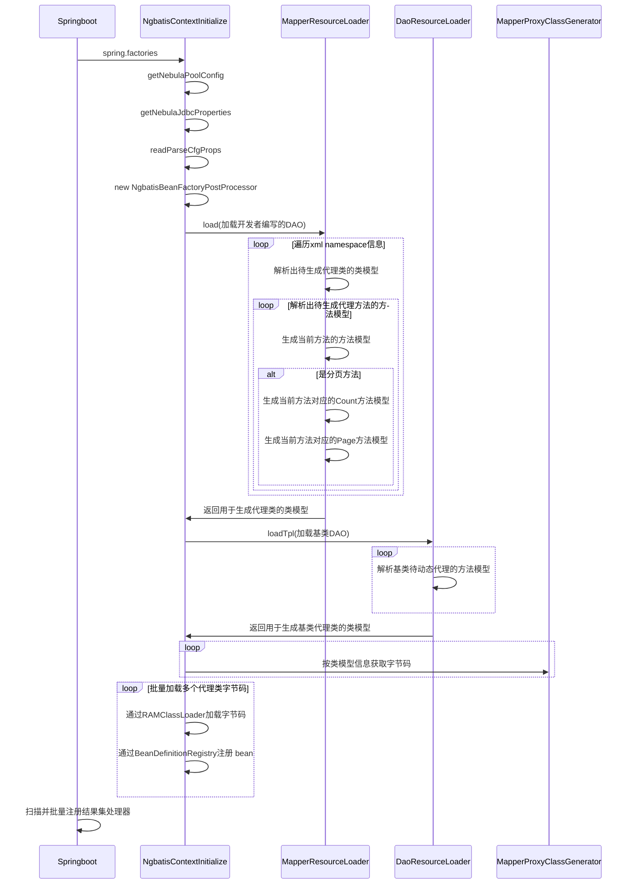
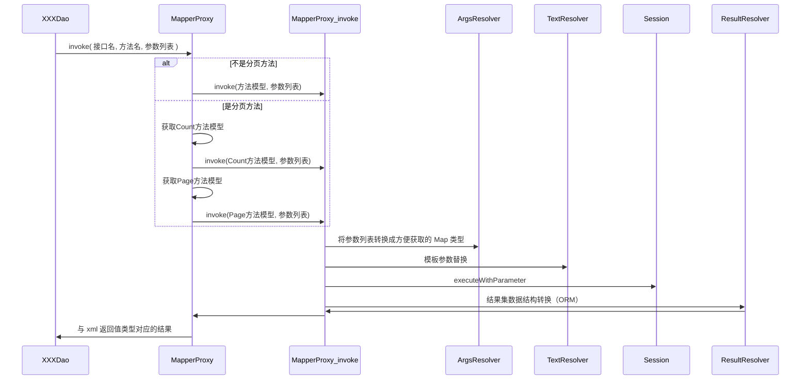

# 运行时序
## 服务启动时的初始化过程

```mermaid
sequenceDiagram
  Springboot->>NgbatisContextInitialize: spring.factories
  NgbatisContextInitialize->>NgbatisContextInitialize: getNebulaPoolConfig
  NgbatisContextInitialize->>NgbatisContextInitialize: getNebulaJdbcProperties
  NgbatisContextInitialize->>NgbatisContextInitialize: readParseCfgProps
  NgbatisContextInitialize->>NgbatisContextInitialize: new NgbatisBeanFactoryPostProcessor
  NgbatisContextInitialize->>MapperResourceLoader: load(加载开发者编写的DAO)
  loop 遍历xml namespace信息
      MapperResourceLoader->>MapperResourceLoader: 解析出待生成代理类的类模型
      loop 解析出待生成代理方法的方法模型
          MapperResourceLoader->>MapperResourceLoader: 生成当前方法的方法模型
          alt 是分页方法
              MapperResourceLoader->>MapperResourceLoader: 生成当前方法对应的Count方法模型
              MapperResourceLoader->>MapperResourceLoader: 生成当前方法对应的Page方法模型
          end
      end
  end
  MapperResourceLoader->>NgbatisContextInitialize: 返回用于生成代理类的类模型
  NgbatisContextInitialize->>DaoResourceLoader: loadTpl(加载基类DAO)
      loop 
          DaoResourceLoader->>DaoResourceLoader:  解析基类待动态代理的方法模型
      end
  DaoResourceLoader->>NgbatisContextInitialize: 返回用于生成基类代理类的类模型

    loop 
      NgbatisContextInitialize->>MapperProxyClassGenerator: 按类模型信息获取字节码
    end

    loop 批量加载多个代理类字节码
      NgbatisContextInitialize->>NgbatisContextInitialize: 通过RAMClassLoader加载字节码
      NgbatisContextInitialize->>NgbatisContextInitialize: 通过BeanDefinitionRegistry注册 bean
    end

  Springboot->>Springboot: 扫描并批量注册结果集处理器
```

## 当代理方法被调用时

```mermaid
sequenceDiagram
  XXXDao->>MapperProxy: invoke( 接口名, 方法名, 参数列表 )
  alt 不是分页方法
      MapperProxy->>MapperProxy_invoke: invoke(方法模型, 参数列表)
  else 是分页方法
      MapperProxy->>MapperProxy: 获取Count方法模型
      MapperProxy->>MapperProxy_invoke: invoke(Count方法模型, 参数列表)
      MapperProxy->>MapperProxy: 获取Page方法模型
      MapperProxy->>MapperProxy_invoke: invoke(Page方法模型, 参数列表)
  end
  MapperProxy_invoke->>ArgsResolver: 将参数列表转换成方便获取的 Map 类型
  MapperProxy_invoke->>TextResolver: 模板参数替换
  MapperProxy_invoke->>Session: executeWithParameter
  MapperProxy_invoke->>ResultResolver: 结果集数据结构转换（ORM）
  ResultResolver->>MapperProxy_invoke: 
  MapperProxy_invoke->>MapperProxy: 
  MapperProxy->> XXXDao: 与 xml 返回值类型对应的结果
```
